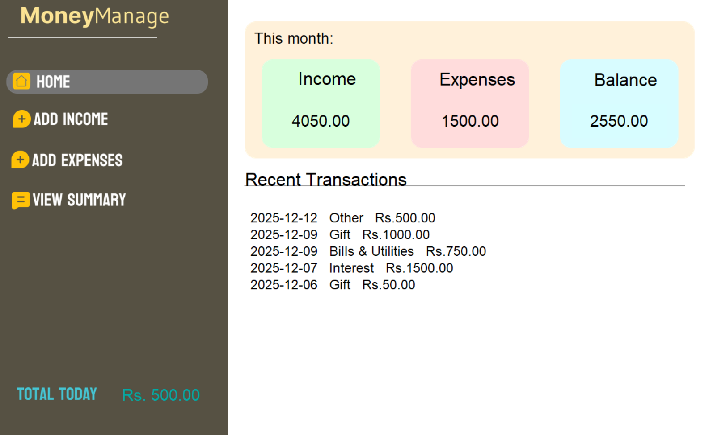
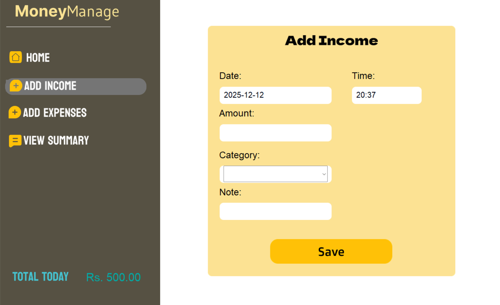

# 📘 MoneyManage – Personal Finance Tracker

MoneyManage is a desktop application built using **Python + Tkinter** that helps users track income, expenses, and financial summaries. It supports multiple users and displays personalized dashboards with recent transactions.

---

## 🚀 Features
- 🔐 User Login & Registration  
- 💰 Add Income (date, time, category, note)  
- 🧾 Add Expenses (date, time, category, note)  
- 📊 Dashboard  
  - Monthly Income  
  - Monthly Expenses  
  - Balance  
  - Today’s Summary  
  - Recent Transactions  
- 🔄 User-specific data (each user sees only their own records)  
- 🛢 MySQL Database Integration  
- ✔ Page navigation between all modules  
- 🎨 Modern UI designed using Tkinter Designer and Figma  

---

## 📂 Project Structure
```
├── add income/
├── add expenses/
├── create account/
├── home/
├── login/
├── view summary/
│
├── db.py
├── main.py
├── session.py
└── README.md
```

---

## 🛠 Technologies Used
- Python 3  
- Tkinter  
- MySQL  
- Tkinter Designer  
- Subprocess module  

---

## 🗄 Database Structure

### **User Table**
| Column    | Description        |
|-----------|--------------------|
| id        | Primary Key        |
| user_name | Username           |
| password  | Password           |

### **Income Table**
| Column      | Description              |
|-------------|---------------------------|
| id          | Primary Key               |
| amount      | Amount                    |
| category    | Category                  |
| note        | Description               |
| date_entry  | Date                      |
| time_entry  | Time                      |
| user_id     | Foreign Key to user(id)   |

### **Expense Table**
Same structure as Income.

---



